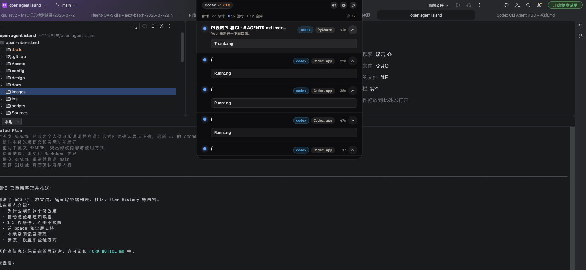
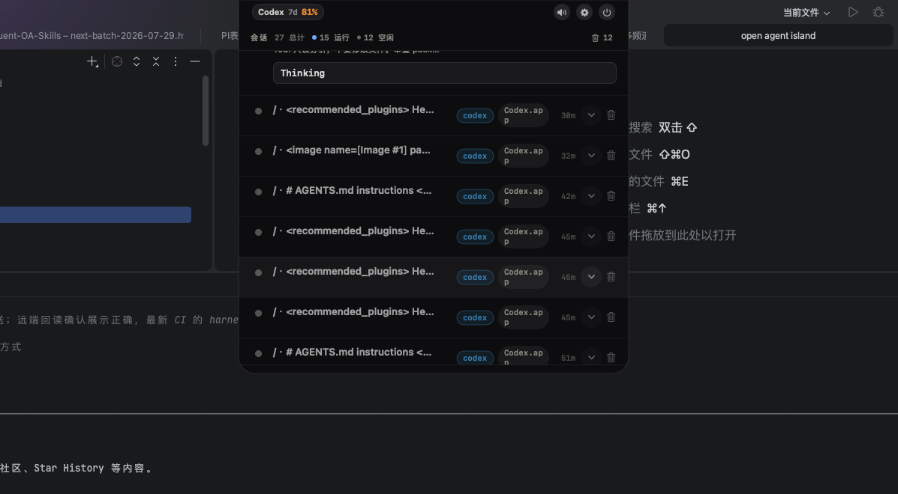

# Agent Mac Island

My personal macOS enhancement of
[Open Island](https://github.com/Octane0411/open-vibe-island), focused on a
quieter top bar: the Island stays out of the way while idle and returns when a
notification or deliberate hover needs it.

[简体中文](README.zh-CN.md) | **English**

> [!IMPORTANT]
> This is an unofficial modified version, not an original project. Open Island
> was created by [Octane0411](https://github.com/Octane0411) and its
> [contributors](https://github.com/Octane0411/open-vibe-island/graphs/contributors).
> I only maintain the changes described below. See
> [FORK_NOTICE.md](FORK_NOTICE.md) for complete attribution.

## Screenshots

**Expanded session overview**



**Idle-record cleanup**



## Why I Made This Version

In the upstream v1.1.6 behavior, moving the pointer away collapses the panel
into a small capsule that remains at the top of the screen. My goal was to make
the Island notification-driven:

- no permanent capsule covering the top of the current app;
- no invisible window intercepting browser or IDE clicks;
- reliable reveal in macOS Spaces and full-screen apps;
- important Codex events still appear automatically;
- stale local session records can be cleared without stopping background work.

## What I Changed

| Change | Behavior in this version |
|---|---|
| Auto-hide mode | Added a persistent **Auto-hide (show on hover or notifications)** setting. It is off by default, so upstream behavior remains available. |
| Fully hidden idle state | With auto-hide enabled, the panel becomes visually transparent and click-through instead of leaving a capsule on screen. The app, hooks, monitoring, and bridge socket continue running. |
| Hover-only manual reveal | Keep the pointer at the top center for about **1.5 seconds** to open the Island. Clicking the hidden trigger does not open it and cancels a pending hover timer. |
| Delayed hide | After the pointer leaves, the Island waits about **1.5 seconds** before hiding. Re-entering during that delay cancels the hide. |
| Cross-Space support | The `NSPanel` remains ordered with `.canJoinAllSpaces` and `.fullScreenAuxiliary`; hiding uses zero alpha and disabled mouse handling instead of `orderOut`. |
| Notification lifecycle | Completion and failure notifications can appear while hidden and ordinary notifications retain the roughly 10-second auto-close behavior. Permission requests and questions remain visible until handled. |
| Codex `/plan` questions | Detects current `request_user_input` records in Codex rollout JSONL, shows the complete question and options as a persistent notification, and provides a **Return to Codex** action. Answers remain in Codex because this event has no response hook. |
| Idle-record cleanup | Added per-row and bulk cleanup for local idle records. Cleanup only changes the Island presentation state; it does not delete original agent sessions or terminate processes. New activity makes a cleared session visible again. |
| Persistent cleanup state | Cleared idle records remain hidden after an app restart through a local, versioned dismissal store. |
| Localized UI | Updated English, Simplified Chinese, and Traditional Chinese text for auto-hide and idle cleanup. |
| Development launch | `scripts/launch-dev-app.sh` can launch with the committed icons when Pillow is unavailable. |
| Regression harness | Added smoke coverage for hidden/ordered state separation, click-through, hover timing, delayed hide cancellation, notification reveal, actionable notifications, and idle cleanup. |

## Resulting Behavior

| Situation | Result |
|---|---|
| Auto-hide disabled | The original always-present collapsed capsule behavior remains. |
| Auto-hide enabled and idle | The UI is completely invisible and does not intercept clicks. |
| Pointer hovers at top center for 1.5 seconds | The Island opens manually. |
| User clicks the hidden top-center area | The underlying app receives the click; the Island stays hidden. |
| Codex completes or fails | A notification appears automatically, then ordinary notifications close after their display period. |
| Codex requests permission or asks a question | The actionable notification stays visible until it is handled. |
| Codex `/plan` calls `request_user_input` | The Island shows the full question and choices; choose **Return to Codex**, answer there, and the notification resolves when Codex continues. |
| User switches Spaces or enters a full-screen app | The hidden trigger and notifications remain available on the active Space. |
| UI is hidden | Hooks, session monitoring, the app process, and `OpenIsland/bridge.sock` keep running. |

## Build and Use This Version

### Requirements

- macOS 14 or later
- Xcode with Swift 6.2 or later

### Launch the development app

```bash
git clone https://github.com/dazzlingwuming/agent-mac-island.git
cd agent-mac-island
zsh scripts/launch-dev-app.sh
```

The script builds the app and launches `~/Applications/Open Island Dev.app`.

### Enable auto-hide

Open:

```text
Open Island Settings → General → Behavior
```

Enable:

```text
Auto-hide (show on hover or notifications)
```

The preference persists across app restarts. It defaults to off.

### Clear local idle records

Open the expanded session list:

- use the trash button on an idle row to remove one local record; or
- use the trash button and count in the list header to clear all eligible local
  idle records after confirmation.

This cleanup does not stop sessions or background processes. A session with new
activity reappears automatically.

## Validation

The modified behavior is covered by the app test and smoke infrastructure:

```bash
swift build --product OpenIslandApp
zsh scripts/harness.sh smoke
zsh scripts/harness.sh smoke-all
```

The smoke scenarios cover the auto-hide window state, click-through behavior,
hover and exit delays, completion and actionable notifications, and isolated
idle-record cleanup.

The source tree retains the upstream technical documentation index at
[docs/index.md](docs/index.md) for architecture and maintenance reference.

## Scope

This repository currently targets macOS only. Reproducing the same interaction
on Windows would require a separate Windows window-management implementation.

For the original Open Island feature set, supported agents, terminals,
architecture, releases, and community links, visit the
[upstream project](https://github.com/Octane0411/open-vibe-island).

## Attribution and License

- Original project:
  [Octane0411/open-vibe-island](https://github.com/Octane0411/open-vibe-island)
- Original author and upstream contributors:
  [contributors](https://github.com/Octane0411/open-vibe-island/graphs/contributors)
- Modification history: preserved in this repository's Git history
- Detailed fork notice: [FORK_NOTICE.md](FORK_NOTICE.md)
- License: [GNU GPL v3](LICENSE)

Upstream authors are not responsible for issues introduced by this modified
version. Please report fork-specific problems in
[`dazzlingwuming/agent-mac-island`](https://github.com/dazzlingwuming/agent-mac-island/issues).
